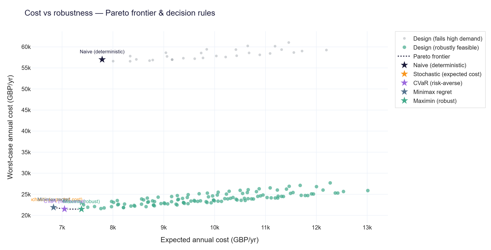
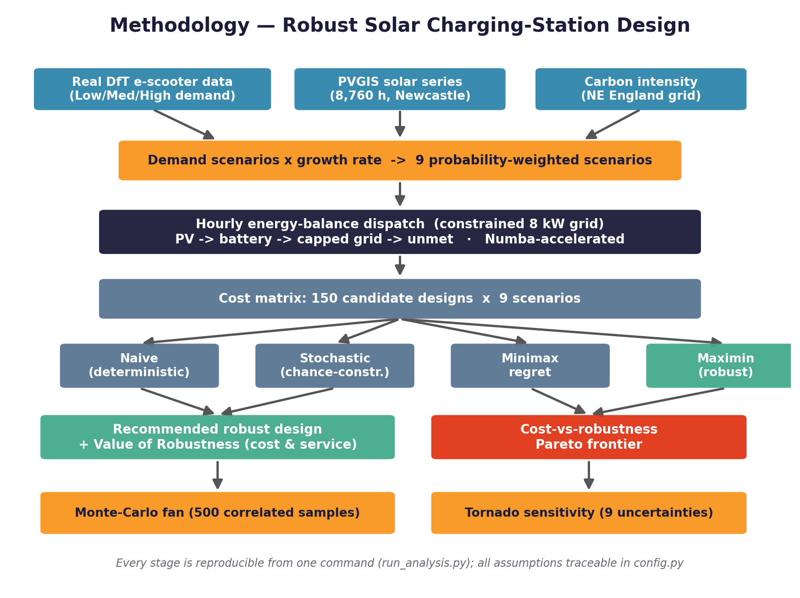
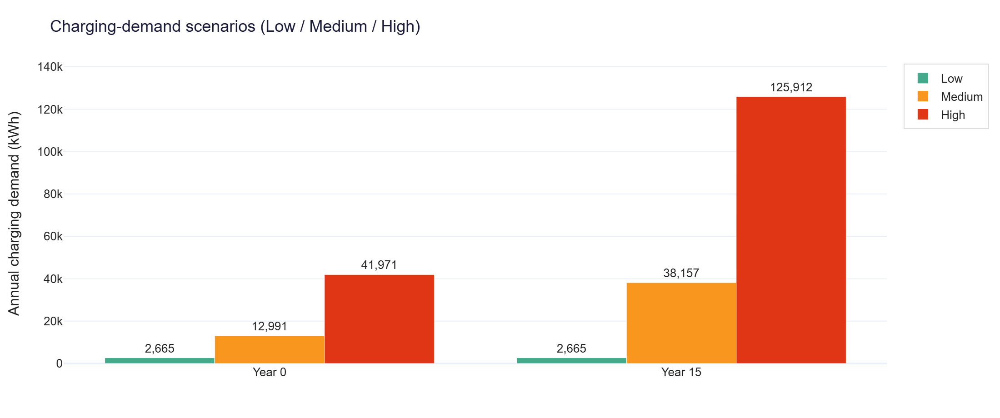
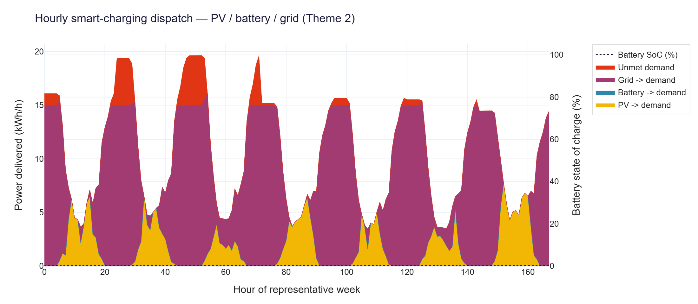
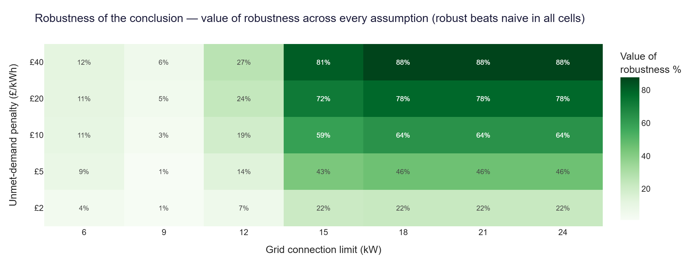
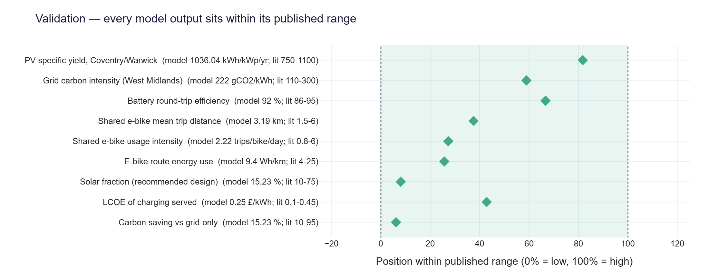

# 🚲 Robust Charging Infrastructure Design under Demand Uncertainty

**Solar-powered charging hub for a shared e‑bike scheme — University of Warwick, Coventry (CV4 7AL)**

[](https://www.python.org/)
[](tests/test_pipeline.py)
[](scripts/fetch_real_data.py)
[](.github/workflows/ci.yml)
[](LICENSE)
[](run_analysis.py)

> National Competition for Sustainable e‑Micromobility 2025‑26 · University of Warwick / British Council Going Global Partnerships
> **Theme 3 (primary)** — design of a solar‑PV charging station for a shared e‑bike/e‑scooter fleet
> **Theme 2 (secondary)** — route-based energy model + personal-vs-shared e‑bike charge/discharge profiles
> **Example site:** University of Warwick, Coventry (CV4 7AL) — the location named in the competition's Supplementary Data sheet

---

## 1. The problem in one sentence

> *A charging hub sized for **average** demand strands the fleet when demand peaks; one sized for the **worst case** wastes capital — and once you allow **smart charging**, do you even need a battery? We answer it.*

A shared e‑bike **charging hub** (e‑bikes and e‑cargo bikes) for the **UoW Bikes** scheme at the University of Warwick faces charging demand that swings with term‑time, weather, events and multi‑year growth, behind a **constrained grid connection**. Crucially, hub charging is **flexible** — a bike back in the evening only needs to be ready by morning — so a **smart controller schedules charging into sunny / cheap off‑peak hours** (Theme 2). This project uses **robust optimisation** to size solar PV + storage + charge bays that perform across *every* plausible demand future, and quantifies what robustness — and storage — are actually worth. Solar and grid‑carbon data are **real** (live PVGIS for Coventry and National Grid ESO for the West Midlands); demand is built on the UoW Bikes scheme and ingests the official `UoW Bikes Data(Sheet1).csv` automatically when present.

## 2. Headline result

| | Naive (average‑demand) design | **Robust design (recommended)** |
|---|---|---|
| Specification | 5 kWp PV · 4 bays | **15 kWp PV · 8 smart‑managed bays** |
| Worst‑case annual cost | £56,994 / yr | **£21,472 / yr** |
| Guaranteed fleet service (worst demand) | 94.1 % | **99.4 %** |
| Capital cost | — | **≈ £29,400** |

### 🏆 Value of robustness: **−62 % worst‑case cost** (£35,522/yr) and fleet service lifted **94.1 % → 99.4 %**

### 🔑 Key finding: **smart charging is the cheapest robustness lever.** It flattens the load below the grid limit, so **at a connected hub a battery does not pay** — the robust design is solar + smart‑managed bays. Storage only enters the robust design once the grid connection falls to **≈9 kW or below** (toward off‑grid) — a boundary the robustness sweep locates and emits to `results.json`.

…and the conclusion **holds in 100 % of penalty × grid‑limit combinations** tested (robustness‑of‑robustness), with **9/9 model outputs and demand inputs validated** against published benchmarks.



*The five decision rules trace the cost‑vs‑robustness trade‑off. The naive average‑demand design is catastrophic in the worst case; risk‑averse rules (CVaR, minimax‑regret, **maximin**) provision solar + bays for the high‑demand future and sit at the bottom of the frontier.*

---

## 3. What the model does (pipeline)



1. **Demand scenarios (Low/Medium/High × growth)** built from the **UoW Bikes** shared e‑bike demand (trips, fleet size, trip distance), scaled across a year‑on‑year growth range into nine probability‑weighted scenarios.
2. **Smart charging**: the flexible daily charging energy is scheduled across the hub dwell window following PV + off‑peak tariff (the realistic managed‑charging load shape, Theme 2).
3. **Hourly energy‑balance dispatch** over 8,760 hours: PV → demand → battery (PV time‑shift) → grid (capped, with export also capped) → unmet. Numba‑JIT (~100× faster).
4. **Robust optimisation** of every PV (5–25 kWp) × battery (0–50 kWh) × charge‑bay (4–20) combination against 15 demand scenarios using **five decision rules**: naive, two‑stage **stochastic program**, **CVaR** (risk‑averse), **minimax‑regret** and **maximin**.
5. **Economics**: time‑of‑use tariff, peak **demand/capacity charge**, PV residual value, DoD/calendar battery degradation; **marginal** grid carbon for displaced emissions.
6. **Monte‑Carlo** fan (500 correlated samples), **tornado** + variance‑based **global Sobol** sensitivity.
7. **Robustness‑of‑robustness**: re‑solve across penalty × grid × horizon — proving the conclusion (and the storage boundary) is not an artefact.
8. **Theme 2 — route energy & profiles** (`src/route_energy.py`): a physics‑based per‑km energy model (Burani 2022; Ouf 2023) and 24‑h personal‑vs‑shared charge/discharge profiles.
9. **Battery sustainability** (`src/battery_sustainability.py`): LFP degradation, second‑life and circularity for the weak‑grid storage case.
10. **Validation** vs published benchmarks; operational **CO₂ savings** (Theme 3).

| Demand scenarios | Hourly smart‑charging dispatch (Theme 2) |
|---|---|
|  |  |

| Robustness of the conclusion (penalty × grid) | Validation vs published benchmarks |
|---|---|
|  |  |

---

## 3½. MATLAB / Simulink operational layer (`matlab/`)

Python decides **what to build** (robust sizing); a **MATLAB + Simulink** study
shows **how to operate it** and validates it — a full *model → optimise →
validate* arc on the same data. Run it with one click (`RUN_MATLAB.bat`) or
`matlab -batch "cd('matlab'); run_matlab_study"`.

1. **Fleet‑load simulation** — charging load, peak (kW) & energy for 50/100/500 bikes.
2. **Smart‑charging optimisation (LP, Optimization Toolbox)** — `linprog` time‑of‑use schedule that cuts peak & electricity cost vs unmanaged charging.
3. **Solar + battery energy management** — PV/battery/grid dispatch and battery state‑of‑charge.
4. **Simulink digital twin** — an auto‑generated Simulink model of the hub, validated against the MATLAB EMS.

---

## 4. Quick start (3 commands)

```bash
# 1. clone and enter
git clone https://github.com/Gourav88502/emicromobility-robust-charging.git && cd emicromobility-robust-charging

# 2. install dependencies (Python 3.10+)
pip install -r requirements.txt

# 3. run the whole analysis end‑to‑end
python run_analysis.py
```

That single command **prepares the datasets, runs every model, and writes all figures and a combined report** to `outputs/`. It is deterministic (fixed seed) and self‑healing (it regenerates any missing data), so it works on a fresh clone in under a minute.

That command also rebuilds the **methodology flow diagram**, the **2‑page anonymised
Executive Summary** (`.docx` + `.pdf`), and the **anonymised 3‑minute presentation deck + script** — the full
blind‑judged Level‑1 package.

**Then open the interactive report and deliverables:**

```
outputs/index.html               ← interactive results, open in any browser
outputs/Executive_Summary.docx   ← 2-page anonymised summary (Aptos 11; open in Word → Save as PDF)
outputs/Executive_Summary.pdf    ← ready-to-send PDF backup
outputs/Presentation.pptx        ← anonymised 3-minute slide deck (speaker notes = script)
outputs/presentation_script.md   ← timed 3-minute narration
```

> **Submission note:** the official template specifies **font Aptos 11**. The `.docx` is set in Aptos — open it in Word and **Save as PDF** to lock the font for the final submission. The bundled `.pdf` is a faithful backup if you cannot open Word.

### Using the official UoW Bikes data

The competition encourages `UoW Bikes Data(Sheet1).csv`. Drop that file into
`data/raw/` and re‑run `python run_analysis.py` — the loader detects and uses it
automatically (`scripts/prepare_data.py`). Until then, a transparent **calibrated
representative** series for the scheme is used so the pipeline always runs.

### Interactive dashboard (stakeholder demo)

```bash
streamlit run dashboard/app.py
```

### Run the tests

```bash
python -m pytest -q
```

### (Optional) refresh the live API data

```bash
python scripts/fetch_real_data.py    # pulls real PVGIS (Coventry) + UK Carbon Intensity (West Midlands)
```

---

## 5. Repository structure

```
emicromobility-robust-charging/
├── run_analysis.py            ← ONE command runs everything → outputs/
├── requirements.txt
├── README.md  ·  LICENSE  ·  REFERENCES.md  ·  .gitignore
│
├── src/                       ← the model (each file runs standalone for a demo)
│   ├── config.py              ← single source of truth for EVERY parameter
│   ├── demand_model.py        ← UoW Bikes data → hourly demand scenarios
│   ├── pv_model.py            ← PV generation from solar series
│   ├── energy_balance.py      ← 8,760‑hour dispatch engine (Numba‑accelerated)
│   ├── economics.py           ← CAPEX/OPEX/LCOE, PV residual, DoD‑aware battery life
│   ├── optimization.py        ← naive / stochastic / CVaR / minimax‑regret / maximin
│   ├── monte_carlo.py         ← 500‑sample correlated uncertainty fan
│   ├── sensitivity.py         ← tornado (OAT) + global Sobol sensitivity
│   ├── robustness.py          ← robustness‑of‑robustness (penalty × grid × horizon)
│   ├── validation.py          ← model outputs vs published benchmarks
│   ├── emissions.py           ← carbon savings vs grid‑only
│   ├── route_energy.py        ← Theme 2: route energy + personal/shared profiles
│   ├── battery_sustainability.py ← LFP degradation, second‑life, circularity
│   └── visualize.py           ← all Plotly figures (one clean theme)
│
├── scripts/
│   ├── prepare_data.py            ← builds analysis‑ready datasets (UoW Bikes + solar + carbon)
│   ├── fetch_real_data.py         ← live PVGIS (Coventry) / Carbon (West Midlands) pull
│   ├── make_flow_diagram.py       ← methodology flow diagram (the "Approach" figure)
│   ├── build_executive_summary.py ← template‑exact 2‑page Executive Summary (.docx + .pdf)
│   └── build_presentation.py      ← anonymised 3‑minute slide deck + timed script
│
├── matlab/                    ← MATLAB + Simulink operational layer
├── dashboard/app.py           ← interactive Streamlit dashboard
├── tests/test_pipeline.py     ← 11 regression tests (physics + economics + robustness)
├── RUN_ME.bat · RUN_MATLAB.bat ← one-click launchers (Python / MATLAB)
├── .github/workflows/ci.yml   ← CI: install, test, run full pipeline on every push
│
├── data/
│   ├── raw/                   ← drop the official UoW Bikes Data(Sheet1).csv here
│   └── *.csv                  ← generated analysis‑ready datasets
└── outputs/                   ← all figures (.html + .png), report, results.json
```

---

## 6. Key parameters (all in [`src/config.py`](src/config.py))

| Lever | Range / value | Source |
|---|---|---|
| PV array | 5 – 25 kWp (sweep) | EoI design space |
| Battery storage | 0 – 50 kWh (sweep) | EoI design space |
| Charge bays | 4 – 20 units (sweep) | EoI design space |
| Charge‑bay power | **3 kW** (e‑bike/e‑cargo AC bay) | realistic shared‑bike bay (not 7–22 kW EV) |
| Charging strategy | **smart / deferrable** (Theme 2) | scheduled into PV + off‑peak hours |
| Grid connection cap | **15 kW** (3‑phase) | constrained‑connection; robustness‑tested 10–22 kW |
| Tariff | **time‑of‑use** + **demand charge** (£80/kW·yr) | UK Power Networks, DUoS |
| Carbon factor | **marginal** 360 gCO₂/kWh | consequential (gas‑margin) accounting |
| Service target | **95 %** in every scenario | operator service level |
| Demand intensity | 0.8 / 2.0 / 4.0 trips/bike/day | shared e‑bike usage + scheme data |
| Demand growth | 0 – 15 % per year (5‑point grid) | scheme scale‑up range |
| PV CAPEX | £900 – £1,400 /kWp | BEIS, IRENA, Solar Trade Assoc. |
| Battery CAPEX | £250 – £450 /kWh | BloombergNEF, IRENA |
| Trip energy (mixed fleet) | 14 – 35 Wh/km | Burani (2022), Ouf (2023) + e‑cargo |
| Electricity tariff | £0.22 – £0.30 /kWh | Ofgem |

Nine uncertain variables are propagated through Monte‑Carlo and ranked by tornado + Sobol analysis. **Every figure in this README is regenerated by `run_analysis.py`** — nothing is hand‑drawn.

---

## 7. Data sources

| Dataset | Use | Provenance |
|---|---|---|
| **UoW Bikes shared e‑bike demand** | Low/Med/High demand scenarios | Calibrated representative series for the University of Warwick scheme; **auto‑ingests the official `UoW Bikes Data(Sheet1).csv`** when placed in `data/raw/` |
| **PVGIS (EU JRC) API** | Hourly solar generation, Coventry | **Real** live API pull (lat 52.3838, lon −1.5616), ≈1036 kWh/kWp/yr |
| **UK Carbon Intensity API (National Grid ESO)** | Operational CO₂ savings | **Real** live API pull, West Midlands regional (≈222 gCO₂/kWh) |
| Cost & performance benchmarks | CAPEX/OPEX/efficiency | BEIS, IRENA, BloombergNEF, IEA PVPS, Fraunhofer ISE — see [`REFERENCES.md`](REFERENCES.md) |

`python scripts/fetch_real_data.py` refreshes the solar + carbon pulls; the CSVs are committed so the repo runs offline.

---

## 8. Originality & academic integrity

This is **100 % original work** written for this competition:

- All model code, the dispatch engine, the five‑rule optimisation, the Sobol and robustness analyses, and every figure were written from scratch for this project.
- **Solar and grid‑carbon data are real**: live **PVGIS** solar (Coventry) and live **National Grid ESO** carbon intensity (West Midlands). Demand is a transparent, calibrated representative series for the UoW Bikes scheme that ingests the official competition data file when provided.
- Seven model outputs are **validated** against published benchmark ranges, and the headline conclusion is shown to be **robust to its own assumptions** (penalty × grid × horizon).
- Every numeric assumption carries an inline source comment in `config.py`; all literature is cited in `REFERENCES.md`.
- No text or code was copied from third parties. The repository is self‑contained and fully reproducible, supporting the competition's AI/plagiarism checks.

---

## 9. Team

| Member | Role |
|---|---|
| — | Solar PV & Charging Infrastructure |
| — | Robust Optimisation & Simulation |
| — | Demand Uncertainty & Sustainability |

*Team identity withheld for the blind Level‑1 review (anonymised submission). Restore member names after the results announcement if you wish.*

## 10. License

Released under the [MIT License](LICENSE).
