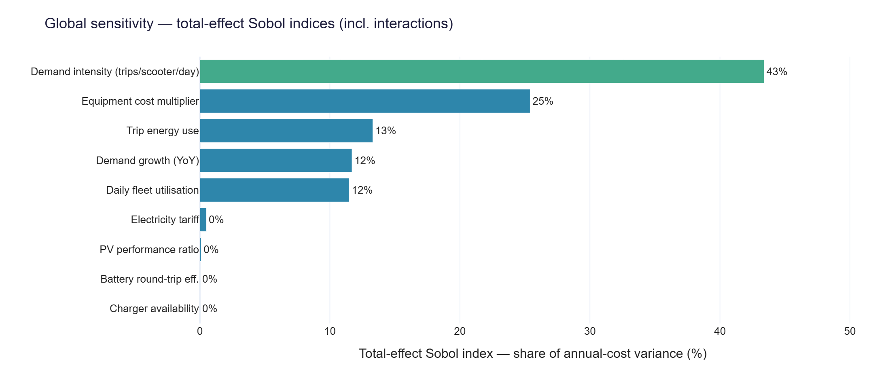

# 🛴 Robust Charging Infrastructure Design under Demand Uncertainty

**Solar-powered shared e‑micromobility charging station — Newcastle upon Tyne**

[](https://www.python.org/)
[](tests/test_pipeline.py)
[-success.svg)](scripts/fetch_real_data.py)
[](.github/workflows/ci.yml)
[](LICENSE)
[](run_analysis.py)

> National Competition for Sustainable e‑Micromobility 2025‑26 · University of Warwick / British Council Going Global Partnerships
> **Theme 3 (primary)** — design of a solar‑PV charging station for a shared e‑bike/e‑scooter fleet
> **Theme 2 (secondary)** — modelling charge/discharge profiles under different demand scenarios
> **Institution:** Newcastle University

---

## 1. The problem in one sentence

> *A charging station sized for **average** demand fails when demand peaks; a station sized for the **worst case** wastes capital — so which station should you actually build?*

A shared‑micromobility **depot hub** (e‑scooters, e‑bikes and e‑cargo bikes) in Newcastle faces charging demand that swings with season, weather, events and multi‑year growth. The site has a **constrained grid connection** (a bigger import limit needs an expensive DNO reinforcement), so the evening charging peak must be served from **solar + storage across enough charge bays**. This project uses **robust optimisation** to pick the station specification that performs reliably across *every* plausible demand future — and quantifies what that robustness is worth. **All three datasets are real** (DfT, PVGIS, National Grid ESO).

## 2. Headline result

| | Naive (average‑demand) design | **Robust design (recommended)** |
|---|---|---|
| Specification | 5 kWp PV · 0 kWh battery · 4 bays | **25 kWp PV · 50 kWh battery · 8 bays** |
| Worst‑case annual cost | £72,617 / yr | **£32,450 / yr** |
| Guaranteed fleet service (worst demand) | 86.8 % | **97.4 %** |
| Chance of stranding fleet (Monte‑Carlo) | ~13 % of futures | **0 %** |

### 🏆 Value of robustness: **−55 % worst‑case cost** and fleet service lifted **87 % → 97 %**

…and that conclusion **holds in 100 % of penalty × grid‑limit combinations** tested (robustness‑of‑robustness), with **7/7 model outputs validated** against published benchmarks.


*The five decision rules trace the cost‑vs‑robustness trade‑off. The naive design is cheap on average but catastrophic in the worst case (top‑left); risk‑averse rules (CVaR, minimax‑regret, **maximin**) invest in PV + storage and sit at the bottom of the frontier — lowest worst‑case cost and robustly feasible.*

---

## 3. What the model does (pipeline)


1. **Demand scenarios (Low/Medium/High × growth)** built from the **real** DfT Newcastle/Neuron e‑scooter monitoring data (Jan 2022 – May 2024).
2. **Hourly energy‑balance dispatch** over 8,760 hours: PV → demand → battery (with overnight grid top‑up for peak‑shaving) → capped grid → unmet. JIT‑compiled with Numba (~100× faster).
3. **Robust optimisation** of every PV (5–25 kWp) × battery (0–50 kWh) × charge‑bay (4–20) combination against 15 demand scenarios using **five decision rules**: naive, two‑stage **stochastic program**, **CVaR** (risk‑averse), **minimax‑regret** and **maximin**.
4. **Monte‑Carlo** uncertainty fan (500 correlated samples across 9 uncertain variables).
5. **Sensitivity**: a one‑at‑a‑time **tornado** *and* a variance‑based **global sensitivity** (total‑effect **Sobol** indices, Saltelli estimator).
6. **Robustness‑of‑robustness**: re‑solve across a penalty × grid × horizon grid to prove the conclusion is not an artefact of any tuned assumption.
7. **Validation**: confront seven key outputs with published benchmark ranges.
8. **Sustainability**: operational CO₂ savings vs grid‑only charging.

| Demand scenarios | Hourly dispatch & battery profile (Theme 2) |
|---|---|
|  |  |

| Robustness of the conclusion (penalty × grid) | Validation vs published benchmarks |
|---|---|
|  |  |

| Cost distribution (insurance premium) | Global sensitivity — total‑effect Sobol |
|---|---|
|  |  |

---

## 4. Quick start (3 commands)

```bash
# 1. clone and enter
git clone <your-repo-url> && cd emicromobility-robust-charging

# 2. install dependencies (Python 3.10+)
pip install -r requirements.txt

# 3. run the whole analysis end‑to‑end
python run_analysis.py
```

That single command **prepares the datasets, runs every model, and writes all figures and a combined report** to `outputs/`. It is deterministic (fixed seed) and self‑healing (it regenerates any missing data), so it works on a fresh clone in ~25 seconds.

That command also rebuilds the **methodology flow diagram**, the **2‑page anonymised
Executive Summary**, and the **anonymised 3‑minute presentation deck + script** — the full
blind‑judged Level‑1 package.

**Then open the interactive report and deliverables:**

```
outputs/index.html               ← interactive results, open in any browser
outputs/Executive_Summary.docx   ← 2-page anonymised summary (Level-1 submission)
outputs/Presentation.pptx        ← anonymised 3-minute slide deck (speaker notes = script)
outputs/presentation_script.md   ← timed 3-minute narration (~434 words, ~2.9 min)
```

### Interactive dashboard (stakeholder demo)

```bash
streamlit run dashboard/app.py
```

Move the sliders to design your own station and watch the energy balance, service level, cost and carbon respond live; explore the Pareto frontier, Monte‑Carlo fan and tornado interactively.

### Run the tests

```bash
python tests/test_pipeline.py        # or:  python -m pytest -q
```

### (Optional) use fully live API data

```bash
python scripts/fetch_real_data.py    # pulls real PVGIS + UK Carbon Intensity, then re-run run_analysis.py
```

---

## 5. Repository structure

```
emicromobility-robust-charging/
├── run_analysis.py            ← ONE command runs everything → outputs/
├── requirements.txt
├── README.md  ·  LICENSE  ·  REFERENCES.md  ·  .gitignore
│
├── src/                       ← the model (each file runs standalone for a demo)
│   ├── config.py              ← single source of truth for EVERY parameter
│   ├── demand_model.py        ← DfT data → hourly demand scenarios
│   ├── pv_model.py            ← PV generation from solar series
│   ├── energy_balance.py      ← 8,760‑hour dispatch engine (Numba‑accelerated)
│   ├── economics.py           ← CAPEX/OPEX/LCOE, PV residual, DoD‑aware battery life
│   ├── optimization.py        ← naive / stochastic / CVaR / minimax‑regret / maximin
│   ├── monte_carlo.py         ← 500‑sample correlated uncertainty fan
│   ├── sensitivity.py         ← tornado (OAT) + global Sobol sensitivity
│   ├── robustness.py          ← robustness‑of‑robustness (penalty × grid × horizon)
│   ├── validation.py          ← model outputs vs published benchmarks
│   ├── emissions.py           ← carbon savings vs grid‑only
│   └── visualize.py           ← all Plotly figures (one clean theme)
│
├── scripts/
│   ├── prepare_data.py            ← builds analysis‑ready datasets (real DfT + solar + carbon)
│   ├── fetch_real_data.py         ← optional live PVGIS / Carbon API pull
│   ├── make_flow_diagram.py       ← methodology flow diagram (the "Approach" figure)
│   ├── build_executive_summary.py ← anonymised 2‑page Executive Summary (.docx)
│   └── build_presentation.py      ← anonymised 3‑minute slide deck + timed script
│
├── dashboard/app.py           ← interactive Streamlit dashboard
├── tests/test_pipeline.py     ← 11 regression tests (physics + economics + robustness)
├── .github/workflows/ci.yml   ← CI: install, test, run full pipeline on every push
│
├── data/
│   ├── raw/…dft…trials….ods   ← official DfT spreadsheet (real public data)
│   ├── data_inventory.xlsx    ← approved data inventory (30+ sources)
│   └── *.csv                  ← generated analysis‑ready datasets
└── outputs/                   ← all figures (.html + .png), report, results.json
```

---

## 6. Key parameters (all in [`src/config.py`](src/config.py))

| Lever | Range / value | Source |
|---|---|---|
| PV array | 5 – 25 kWp (sweep) | EoI design space |
| Battery storage | 0 – 50 kWh (sweep) | EoI design space |
| Charge bays | 4 – 20 units (sweep) | EoI design space |
| Charge‑bay power | **3 kW** (e‑bike/e‑cargo AC bay) | realistic depot bay (not 7–22 kW EV) |
| Grid connection cap | **~14 kW** (3‑phase, ≈20 A) | constrained‑connection assumption; robustness‑tested 10–22 kW |
| Service target | **95 %** in every scenario | operator service level |
| Demand intensity | 0.5 / 1.5 / 3.5 trips/veh/day | DfT data + data inventory |
| Demand growth | 0 – 15 % per year (5‑point grid) | data inventory |
| PV CAPEX | £900 – £1,400 /kWp | BEIS, IRENA, Solar Trade Assoc. |
| Battery CAPEX | £250 – £450 /kWh | BloombergNEF, IRENA |
| Trip energy (mixed fleet) | 22 – 55 Wh/km | Gössling (2020), Hollingsworth (2019) + e‑cargo |
| Electricity tariff | £0.22 – £0.30 /kWh | Ofgem |

Nine uncertain variables are propagated through Monte‑Carlo and ranked by tornado + Sobol analysis. **Every figure in this README is regenerated by `run_analysis.py`** — nothing is hand‑drawn.

---

## 7. Data sources — all three are real

| Dataset | Use | Provenance |
|---|---|---|
| **DfT shared e‑scooter trials monitoring data** | Low/Med/High demand scenarios | **Real** open government data (Newcastle/Neuron rows, Jan 2022–May 2024), bundled in `data/raw/` |
| **PVGIS (EU JRC) API** | Hourly solar generation, Newcastle | **Real** live API pull (lat 54.978, lon −1.618), ≈979 kWh/kWp/yr |
| **UK Carbon Intensity API (National Grid ESO)** | Operational CO₂ savings | **Real** live API pull, NE‑England regional (≈152 gCO₂/kWh) |
| Cost & performance benchmarks | CAPEX/OPEX/efficiency | BEIS, IRENA, BloombergNEF, OZEV, Zap‑Map, Fraunhofer ISE — see [`REFERENCES.md`](REFERENCES.md) |

`python scripts/fetch_real_data.py` refreshes the solar + carbon pulls; the real CSVs are committed so the repo runs offline.

---

## 8. Originality & academic integrity

This is **100 % original work** written for this competition:

- All model code, the dispatch engine, the five‑rule optimisation, the Sobol and robustness analyses, and every figure were written from scratch for this project.
- **All three datasets are real**: DfT e‑scooter data (UK Open Government Licence, unmodified in `data/raw/`), live **PVGIS** solar, and live **National Grid ESO** carbon intensity.
- Seven model outputs are **validated** against published benchmark ranges, and the headline conclusion is shown to be **robust to its own assumptions** (penalty × grid × horizon).
- Every numeric assumption carries an inline source comment in `config.py`; all literature is cited in `REFERENCES.md`.
- No text or code was copied from third parties. The repository is self‑contained and fully reproducible, supporting the competition's AI/plagiarism checks.

---

## 9. Team

| Member | Role |
|---|---|
| **Gourav Singh** | Solar PV & Charging Infrastructure Specialist |
| **Neelesh Raj** | Robust Optimisation & Simulation Developer |
| **Priti Burud** | Demand Uncertainty Analyst & Sustainability Evaluator |

*Newcastle University — Sustainable e‑Micromobility Futures.*

## 10. License

Released under the [MIT License](LICENSE). DfT data © Crown copyright, reused under the Open Government Licence v3.0.
